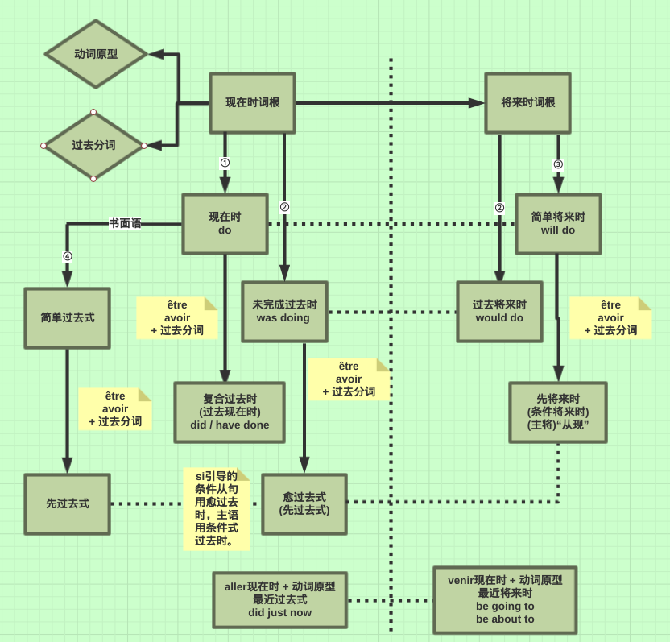

# 法语直陈式动词结构浅析

[TOC]

## 综述

​	笔者在法语学习中，发现法语直陈式的动词变位的一些规律，并总结为一套理论，与各位分享。通过这套理论，除少数特例动词的变位需要特殊记忆之外，只需记忆不同种类动词的变位规律，即可轻松掌握看似复杂的动词变位。第三组动词的各种时态，变位也不再无规律可循。

​	我决定把这套理论编写成程序，可一键生成法语动词的变位，目前正在研发当中。

​	这套理论，思维图如下。其中，每个动词都有一个**现在时词根**，和一个**决定属性的后缀**，现在时词根与该后缀连接生成动词原因，而之后的所有变化，除特例之外，都由**现在时词根**衍生变化而成，包括将来时词根，过去分词，以及各种时态的变化。例如动词faire，其现在时词根为fai，后缀为re，将来时词根为fer(特殊)，过去分词为fait。

​	在图中，实线箭头表示生成关系，竖虚线表示现在时和将来时的分割，横虚线表示同级关系。

​	

## 规定

### 法则1

现在时词根 -> 现在时

第二三种情况，第一二三人称单数的结尾多为s, s, t(d)，故称为“**sst变化**”，法则3也采用这种形式；

类似地，而第一种情况称为“**a(e)sa(e)变化**”，法则2也采用这种形式。

1. -er

   > e, es, e, ons, ez, ent

2. -ir

   > is, is, it, issons, issez, issent

3. others

   > s, s, t(d), ons,  ez, ent

### 法则2

现在时词根 -> 未完成过去式，将来时词根 -> 过去将来时

> ai, as, a, ons, ez, ont

注意：第三人称复数的后缀是ont，而非ent

### 法则3

将来时词根 -> 简单将来时

> ais, ais, ait, ions, iez, aient

可以看出，第一二人称复数的后缀和其他人称不同，这也是动词变位中一个很显著的变化。

## 第一组动词（以-er结尾的所有动词）

### 属性

- 属性后缀：er
- 过去分词：+é
- 将来时词根：+er
- 使用法则1.1, 2, 3

### 特殊方法

### 特例

- aller
  - 现在时，je vais, tu vas, il va, ils vont.
  - 将来时词根ir
- acheter【e/è未归纳】
  - 现在时非第一二人称复数，使用词根achèt.
  - 将来时词根为achèter，过去将来时第三人称复数除外。
- appeler【双写辅音字母，未归纳】
  - 现在时非第一二人称复数，双写l，如：tu appelles.
  - 将来时词根双写l变为appeller.
- commencer【c/ç转化，待归纳】
- envoyer【i/y转化，待归纳】
- manger【未归纳】

## （官方归类的）第二组动词

### 属性

- 属性后缀：ir
- 过去分词：+i
- 将来时词根：+ir
- 使用法则1.2, 2, 3

## 以re结尾的动词

### 属性

- 属性后缀：re

- 过去分词

  - 向前推一个音节，再加+u

    > attend(re) -> attendu

  - 直接+u

    > d

- 将来时词根：+r

## 以-voir结尾的动词

### 属性

- 属性后缀：oir（-voir是-oir的子类）
- 过去分词：退位+u
  - dev(oir) -> dû
  - recev(oir) -> reçu
- 在现在时非第一二人称复数中，词根有所不同
  - recev(oir) -> reçoi
  - sav(oir) -> sai（ils savent）
  - dev(oir) -> doi（ils doivent）
  - pou(voir) -> (je peux/pris, tu peux, il peut, ils peuvent)
- 将来时词根：+r
  - pou(voir) -> pourr

### 特例

- avoir
  - j'ai, tu as, il a, ils ont.
  - 过去分词eu，将来时词根aur
- voir << prévoir【i/y转换，待归纳】
  - 未完成过去式词根为voy
  - 现在时词根voi，第一二人称复数i -> y为voyons, voyez
  - 将来时词根verr

## 特殊说明

- << 符号意为

prendre -> pris  -dre

------

[Defjia](mailto:iam@defjia.top) 2018 @ All rights reserved.