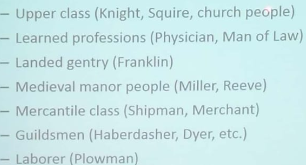
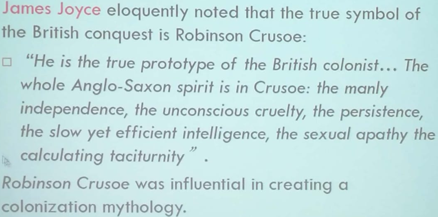
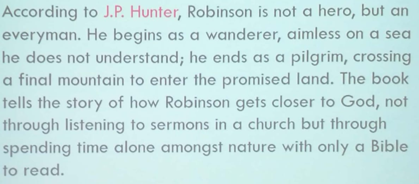
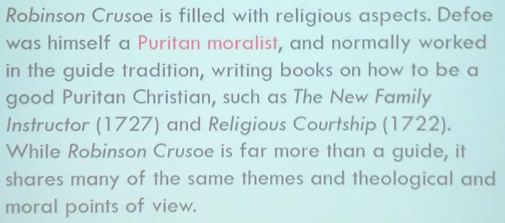
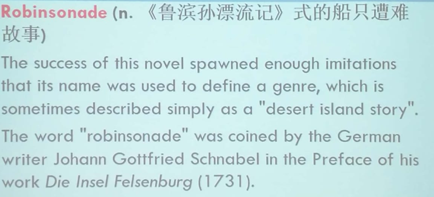
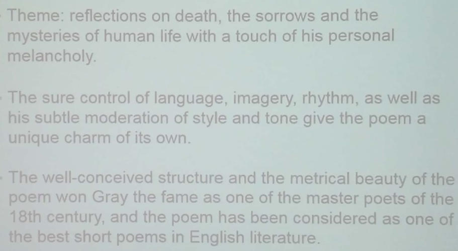
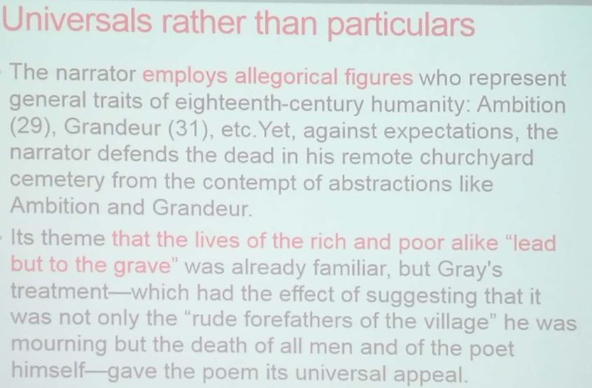

# Part I The Middle Ages

##Chapter 1 - *Beowulf*

- | Pagan Poetry(非基督教的) |   Christian Peotry   |
  | :-----------------: | :------------------: |
  |    secular(世俗的)     |      religious       |
  |   oral sagas(传说)    | biblical story(圣经故事) |
  English literature **began** with the Anglo-Saxon settlement in England.
- *Beowulf*
  - The earliest examples of English literature
  - England's national epic
  - deeds of the Teutonic(Germanic) hero Beowulf
  - **Theme**: primitive people** wage heroic struggle against hostile force of the natural word under a wise and mighty leader.
    An example of the mingling of the nature myths and heroic legends.
  - Literary features
    - Alliteration(押头韵)
    - Compound-words(代名词, 与metaphor类似)
    - Understatement(低调陈述)
    - mixture of [Nature myths & Heroic legends / Pagan & Christian]
  - **Characters**
    - Grendel - monster
    - Hrothgar - the King of Danes
##~~Chapter 2~~
##Chapter 3 Chaucer & *Canterbury Tales*
- Father of English poetry
- One of the greatest narrative poets
- The first in the Poets' Corner in Westminster Abbey
- **Literary Career**
  - The French Period (宫廷)
    - *The book of the Duchess* *公爵夫人之书*
    - *The Romance of the Rose* *玫瑰传奇*
  - The Italian Career (神学)
    - *Troilus and Criseyde*
  - The English Career (平民)
    - ***The Canterbury Tales*** ***坎特伯雷故事集***
      - 1 general prologue
        32 pilgrims 朝圣者
        24 tales
      - a group of pilgrims as they travel together on a journey from London to Canterbury to visit the shrine of Saint Thomas Becket at Canterbury Cathedral.
      - Pilgrims(Characters)
        
      - Rhyme 尾韵
        Heroic Couplet 英雄双韵体
        AA BB CC DD
      - Rhythm节奏
        **Iambic Pentameter 抑扬格五音步
##~~Chapter 4~~

------

# Part II The Renaissance

- A time of renewed interest in things of this world

- Manifestation(表现) - Humanism

  Concerned with human interests and values

- Renaissance Man

  - successful in business, well-mannered, educated, athletic, brave
  - The goal of education became making people well-rounded
  - The authority and power of church and religion wes questioned

- Symbols

  - The Gutenberg Bible

  - Copernicus 哥白尼

  - Niccolo Machiavellie - *The Prince* *君主论*

  - Desiderius Erasmus 教育家 

  - Reformation of religion - Edward VI, Mary I, Queen Elizabeth 

    Financial corruption, abuse of power, immorality

- Main characters 

  - Da Vinci
  - Shakespear

##Chapter 5 Williams Shakespare**

- A great humanist, poet

- produced 37 plays, 154 sonnets and 2 long poems

  - Apprenticeship - Histories and comedies

    - *Romeo and Juliet*

  - Mature period - Love

    - *As You Like It* *皆大欢喜*

    - *Mid-summer Night's Dream*

    - *Twelfth Night*

    - *The Merchant of Venice* - Justice & Law & Mercy

      求婚 -> 私奔 -> 戒指 -> 法庭 (give & take)

      - Bassanio - Fortune hunter, Prodigal son 浪子
      - Portia - Celebrated beauty
      - Antonio - the Merchant
      - Shylock - the Usurer 高利贷者

  - Flourishing Period - Gllom and Depression

    - *Hamlet*
    - *Othello*
    - *King Lear*
    - *Macbeth*

  - The fourth Period - Dramatic romances, unrealistic, fantasy

    - *Cymbeline, King of Britain 辛白林*
    - *The Winter's Tale*
    - *The Tempest 暴风雨*
    - *The Life of King Henry VIII*

- Sonnets

  - Love, beauty, politics, mortality(死亡)

  - **Metre 格律**

    **Iambic Pentametre 五步抑扬格**

  - Rhyme 韵律

    abab cdcd efef gg

- Writing Style

  - Borrowed plot - Ancient Greek & Roman sources
  - Irony 反讽
  - Disguise 变装
  - Creation of new words and Distortion(扭曲) of old meaning

##Chapter 6 Bacon

- *Of Truth*
- *Of Studies*

------

# Part III The Period of Revolution and Restoration(复辟)

- Puritan influence
- the Mryaphysical School(玄学派)
- the Cavalier poets(保皇派)
- French influence - the rhymed couplets

##Chapter 7 John Donne

- the Founder of Mryaphysical School(玄学派)

- Love -> Holy

- *A Valediction: Forbidding Mourning 道别词·莫悲伤*

- World View

  world is sick and every beautiful things has gone.

  We are all waiting for final dissolution.

- Style

  - Conceits 自负

  - emotion & intellect -> wit 巧智

  - Imagery 意象

  - Dramatic & Conversational

    A central Speaker

    Conveyed by conversations

  - cynicism 愤世嫉俗

  - realism

  - frankness

##Chapter 8 John Milton

- the Puritan Poets
- *Paradise Lost 失乐园*
  - the heroic revolt(反抗) against God's authority
  - Satan's rebellion against God & the expulsion(驱逐) of Adam and Eve from the Garden of Eden

##**Chapter 9 John Bunyan - *The Pilgrim's Progress(天路历程)***

- the Puritan Poets

- Religious allegory(宗教寓言)

  - 带有寓言性质的人名地名

  - the Celestial City - an ideal happy society 

    Vanity Fair - the English sociery after the Restoration

    Life - Difficult path

    Human - Pilgrims

    Seek of salvation - Get rid of sufferings and Pursue future

------

#Part IV The Age of Enlightment 启蒙运动

> 18th Britain & today's China
>
> - Commercial society 
> - Industrial Revolution
> - Spiritual and psychological problems
> - self-fashioning

- New genre -> Novel

  Individualism, realism, relied on allegory

- Background

  - The rise of educated middle class
  - The spread of the printing press
  - Economic basis

##Chapter 10 Daniel Defoe & *Robinson Crusoe*

- The true symbol of the British conquest & a colonizetion myth

  

- A pilgrim

  

- A good Puritan Christian

  

- Cultural influences

  

##Chapter 11 Jonathan Swift

- *A Modest Proposal 一个温和的建议*

- *Gulliver's Travel 格列佛游记*

  - Part 1 - A Voyage to Lilliput 小人国 

    Part 2 - A Voyage to Brobdingnag 大人国

    Part 3 - A Voyage to Laputa etc. 飞岛

    Part 4 - A Voyage to the Country of the Houyhnhnms 慧骃国

  - Biting(辛辣的) work of political and social satire(讽刺) of England and Iceland in 18th century

  - ridicules academics, scientosts, and enlightment thinkers

- What's Satire?

  - Use of irony, sarcasm(讽刺), ridicule(嘲讽)
  - A literary composition in which human folly(愚蠢) and vice(缺点) are held up to scorn

##~~Chapter 12~~

##Chapter 13 Henry Fielding

- The greatest novelist of 18th century
- The first conscious novelist
- the founder of realistic novel
- Features 
  - Third-person narration
  - easy, unlaboured(自然的), familiar but vivid, vigorous(有力的)

##Chapter 14 Thomas Gray

- "The best known peom in the English language."

- The beginning of "Literature of melancholy(忧郁文学)"

- Sentimentalism(感伤主义)

- the grave yard school(墓地派)

- Theme - reflections on death, sorrows and mysteries of human life

- Form

  - Iambic pentameter quatrains(四行五步抑扬格)
  - No enjambment(跨行连读)
  - Alliteration(头韵)
  - Parallel syntactic construction(排比的句法结构)

- *Elegy Written in a Country Church Yard 墓畔哀歌*

  

  

##~~Chapter 15~~

##~~Chapter 16~~
##**Chapter 17 William Black**

- *Auguries of innocence 天真的预兆*

  一沙一世界，一花一天堂。无限掌中置，刹那成永恒。

- ​

##**Chapter 18**
##Chapter 19
##Chapter 20
##Chapter 21
##Chapter 22
##Chapter 23
##Chapter 24
##Chapter 25
##Chapter 26
##Chapter 27
##Chapter 28
##Chapter 29
##Chapter 30
##Chapter 31
##Chapter 32
##Chapter 33
##Chapter 34
##Chapter 35
##Chapter 36
##Chapter 37
##Chapter 38
##Chapter 39
##Chapter 40