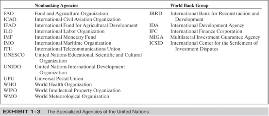

# 国际商法重点总结
[TOC]

## 前言

## 版权声明

​	本文全部内容均由[Ernest Corleone](https://www.facebook.com/ernest.corleone.3)总结完成，由Defjia完成排版工作。

​	All right reserved.

## 题型综述

1. T or F -> 15 * 1=15 pts
2. Basic Concept -> 20 pts
3. 简答题 -> 15 - 20 pts
4. 简答题 -> 15 - 20 pts
5. Mini case
   - do you agree? -> 5 pts
   - why?  10 pts
6. 神秘题 15 pts
   - difference common law and civil law            
   - Advantage and disadvantage of the arbitration 
   - Advantage and disadvantage of the corporation 

## 正文

### Chapter 1. introduction to international and comparative law

#### 1. Customer Law: FOB / CIF

- FOB -> free on board

  adj. referring to purchased goods shipped without transportation charge to a specific place. Free on board at the place of manufacture shows there is a charge for delivery. Example: if an automaker in Detroit sells a car "FOB Detroit," then there will be a shipping charge if delivery is taken anywhere else. If the contract reads "FOB New Orleans," then the auto will be shipped to that city without charge, but with charge for delivery from New Orleans to somewhere else.

- CIF -> Cost Insurance and Freight

  C.I.F.

  n. the total of cost, insurance and freight charges to be paid on goods purchased and shipped.

#### 2. Between countries: comity

​	Held that a court could request compliance by a foreign sovereign as a matter of comity, but could not order compliance.

​	Comity requires that we respect other countries sovereignty and law so that they will respect ours.

- U.S. Courts Apply Comity and Refuse to Take Jurisdiction When:
  - The defendant is a sovereign state
  - Defendant has insufficient contacts with the U.S. 
  - Another judicial forum is more convenient 
  - Congress did not intend U.S. statute to apply extraterritorially (治外法权地)
  - The case concerns act of sovereign state on its own territory 

#### 3. Some country separates another country, how to divide their right?

​	With a change in sovereignty over territory, several legal consequences arise and we apply the following rules.

- Successor states are bound by **dispositive treaties** -treaties concerned with rights over territory (boundaries & servitudes)

- **Merge Rule** - treaties in effect in a former state remain in effect in its territory when in a former state remain in effect in its territory when it becomes part of a new state

  > Eg: Treaties of both Egypt and Syria remained in effect when they merged into the United Arab Republic 

- **Moving Boundaries Rule** - treaties of state absorbing new territory become effective within absorbed territory

  > Eg: France's treaties displaced German treaties in annexed territory of Alsace-Lorraine at end of WWI 

- **Clean State Doctrine** – new state created from colony not bound by treaties of its former colonial power

- **Succession of State** – when two states agree to join and form single state or when a state dissolve into two or more states, the new states are bound by the predecessor’s treaties.

  > Eg: When the Soviet Union split in 1991, the 12 republics were bound by the existing treaties of the Soviet 		Union

#### 4. The difference of IGO and NGO

- International Persons – International Organization 
  - Two kinds of international organizations:
    - Inter-governmental organization (IGO)
    - Private or non-governmental organization (NGO)
  - IGO is a permanent organization set up by two or more states to carry on activities of common interest 
  - NGO is an international organization made up of organizations other than states.
  - May be non-profit NGO or for-profit multinational enterprise (MNE)

- International Persons-IGOs

  - IGO charter (Ex: UN Charter) sets out its 
    - Aims
    - Objectives
    - Internal structures
    - Resources 
    - Express power
  - IGO must be recognized to have legal capacity – the qualification or authority to deal with other international persons.

- Other IGOs

  - **General IGOs** that are devoted to political cooperation, security, & promotion of economic, social, and cultural development include:

    Council of Europe, African Union, Arab League, Organization of American States, Commonwealth of Independent States (former republics of the Soviet Union)

  - **Specialized IGOs** deal with issues of mutual interest such as European Space Agency and International Criminal Police Agency (INTERPOL)

  - **Free Trade Areas** are cooperative economic IGOs. These include the North American FTA (NAFTA)

- International Persons-Nongovernmental Organization (NGOs)
  - Nonprofit NGOs serve as coordinating agencies for private national groups
  - Include international Bar Assoc, Amnesty International, and the International Committee of the Red Cross.
  - For- profit NGOs, known as transnational corporations or multinational enterprises (MNEs), are businesses operating joint ventures in multiple countries. These joint ventures by states have included space and oil exploration.

#### 5.EU/UN organization

##### The United Nations

- Most important IGO

- Its charter is a multilateral treaty 

- Operates though its organs – an agency that carries on specific functions within a larger organizations.

- UN organs are the General Assembly, the Security Council, the International court of Justice, the Trusteeship Council, and the Economic and Social Council 

- various autonomous organizations (also IGOs) that have entered into agreements with the UN to be UN agencies.

  

 ##### The European Union 

​	The European Union is a 27-member IGO created by the founding states in order to integrate their economies and political institutions. 

- The European Treaty in 1992 establish a 

  - political union
  - common citizenship for nationals of member states
  - Social Charter

  - monetary union

  - Central Bank 

  - common currency ( the euro) 

- Euro powers 

  Euro has supranational powers, which are powers surrendered by member states to an IGO. EU law is superior to the laws of member states. This means:

   - The member states are required to bring their internal laws into compliance with EU law
   - The EU law is directly effective within member states

- The European Commission 

  The main institutions of the EU are the:

  ​	European Commission- EU’s executive branch with some legislative function comprised 27 individuals appointed by Parliament 	

  Duties are to:

  1. Ensure that EU rules are respected
  2. Propose measures to the European Council
  3. Implement EU policies
  4. Manage the funds that makes up the EU budget 

- Institution of the EU- Council of the European Union

- Main decision –making body of the EU

  - exercises co-decisions with Parliament 

- Role is to:

  - Adopt legislation (with Parliament)

  - Adopt annual budget (with Parliament)

  - Adopt international agreements 

  - Coordinate the economic policies of the member states

- Institution of the EU- European Parliament 

  - Co-legislation body and main superviysory institution of the EU
  - 786 members elected every five years
  - Arranged by political parties, not by nationality 

- Three main roles :

  - Oversight authority over all EU institutions

  - Shares legislative power with Council of the EU

  - Determines the EU’s annual budget with Council 

- Institution of the EU- European Court of Justice

  - Is the supreme tribunal of the EU
  - Comprised of 27 judges and 8 advocates general
  - Advocate general briefs case for judges and suggest how case should be decided
  - Sits in chambers of three to five judges.

- Hears four kinds of cases:

  - Appeals from the Court of First instance

  - Complaints brought by the commission of by one member against another member

  - Complaints brought by member against EU institution 

  - Complaints to annul EU legal measure

#### 6.The source of International law

1. Treaties or conventions 

   Equivalents of legislation in IL are: 

    - Treaties – legally binding agreement between two or more countries 
    - Convention – legally binding agreement between states sponsored by an international organization 
    - Customary rules that govern treaties are contained in the Vienna Convention on the Law of Treaties, rarified by 108 countries.

2. International custom 

   Custom as Source of International Law, a long–established tradition or usage that becomes customary law if it is:

   - Consistently and regularly observed

     (Evidence of this found in official statements of governments, opinions of legal advisors, executive decrees, orders to military forces, and court decisions)

   - Recognized by those states observing it as a practice that they must obligatorily follow.

3. General principles of law recognized by civilized nations

4. Juridical decisions and teachings of highly qualified legal writers 

### Chapter 2. Settlement of International Disputes

#### 7. What is Arbitration / What is Mediation.  Process of solving dispute of countries--differences

Arbitration:
· Understanding arbitration 
 --- The parties agree to submit a dispute for settlement to private persons, which results in a binding award that will be enforced by the competent court
 --- Its two dimensions
 --- International commercial arbitration 
 --- ad hoc arbitration; institutional arbitration 

· International Commercial Arbitration Institutions 
1.ICC International Court of Arbitration 
2.London Court of International Arbitration 
3.American Arbitration Association (AAA)
4.The Hong Kong International Arbitration Center(HKIAC)
5.China International Economics and Trade Arbitration Commission (CIETAC)

Advantages of international arbitration 
   Being informal 
   Being speedy
   Being professional 
   Being confidential 
   Being neutral 
   Being enforceable 
Disadvantages of international commercial arbitration 
   Costs
   Judicial confirmation 

*  Civil law: governing law first
   Common law: procedures law first

Arbitration procedures：
- Appointment of arbitrators
- Arbitration proceedings
     In institutional arbitration, the arbitration rules of the arbitration institution shall apply to the process of arbitration.

Enforcement of Arbitral Awards:
- Often the arbitration awards can be fulfilled voluntarily by between the parties
- Otherwise, the award must be recognized and enforced by states where the losing party has assets located or where that party resides.

* A member of the New York Convention has the obligation to enforce 
   But should not conflict to local law, public policy, moral, order.

Grounds for refusing to recognize and enforce foreign arbitral awards 

· incapacity of a party to the agreement containing the arbitration clause or the invalidity of the arbitration under the law applicable to a party to the agreement
· lack of proper notice of the arbitration proceedings, the appointment of arbitrators or other reasons denying an adequate opportunity to present a defense
· failure of the arbitral award to restrict itself to the terms of the submission, or decision of matters not within the scope of that submission.
· composition of the arbitral institution not according to the arbitration agreement or applicable law
· non-finally matter of the dispute is not capable of settlement by arbitration under the law of that country
· The recognition or enforcement of the award would be contrary to the public policy of that country.

Settlement of Commercial Disputes Involving States through Arbitration 
  ·International Center for the Settlement of Investment Disputes (ICSID)
  - An arbitration system for setting investment disputes 
  - Its scope of application 

     The dispute must relate to an investment 
     Both the host state and the state of which the private investor is a subject, must be party to the Washington Convention. The private investor cannot be of the same nationalist as the host country.
     The private investor and the host country must have accepted the ICSID jurisdiction.

The ICSID Process
- Before ICSID can convene a panel, two steps must be satisfied:
  1.The host state and the state of the investor must both be parities to the Washington Convention 
  2.The investor and host state must both consent to ICSID jurisdiction 
- Jurisdiction of the ICSID shall extend to any legal dispute arising directly out of an investment.
- Consent to jurisdiction may not be withdrawn 

- Arbitration procedure in ICSID 
  · The tribunal usually consists of three arbitrators, one arbitrator appointed by each party and the third, who shall be chairman of the arbitral tribunal, appointed by agreement of the parities.
  · The arbitration proceedings shall be conducted in accordance with Washington Convention. Unless the parties have agreed otherwise, the arbitrators must follow the arbitration rules drawn up by ICSID
  · Any procedural question rules or by the agreement of the parities, shall be decided by the tribunal.
  · The arbitrators must in the first place apply the law chosen by the parties
  · In the absence of a choice of law, the arbitrators shall apply the national law of the contracting state in which the investment took place (the host country) including its conflicts of law rules.
  · Furthermore, such rules of international law as may be applicable also have to be applied

ICSID Jurisdiction 

ICSID must have jurisdiction over both the parties and over the subject matter of the dispute.
· Personal Jurisdiction – parties appearing must be a state party and national of another contracting state.
   	· A state party is the state itself, its agencies, or its subdivisions
 - The national of another contracting state can be a natural person (human) or a juridical person ( business entity). Juridical person must have a home state outside the investment state. (51% foreign ownership of foreign management)
     · Subject Matter Jurisdiction – ICSID arbitration panels can only decide matters that are:
- Disputes:- Cannot be a collusive action in which the parties are not at odds. Must be a legal dispute where there is a disagreement as to the existence of a legal right or obligation 
- Arise out of an investment – the ICSID convention dose not define investment . Absent an agreement, given the ordinary meaning of putting capital into a venture with the expectation of receiving a profit.

Settlement of Commercial Disputes Involving States through American

Enforcement of ICSID award
The parties shall abide by the award except when the award is annulled 
The grounds for annulment are rather limited:
- improper constitution of the arbitral tribunal
- manifest excess of powers
- corruption of arbitrators
- serious departure from a fundamental rule of procedure and failure to state the reasons on which the award is based.
  Each contracting state shall recognize the award as binding and guarantee the enforcement within its territory as if the ICSID award were a final judgment of a court of that state.

#### 8. The whole process of dispute solving law and under the WTO, the certain kind of process how to solve dispute 

certain kind of process how to solve dispute
· Dispute Settlement in WTO

WTO provides a unified system for settling international trade disputes applicable across all WTO agreements through Understanding on Rules and Procedures Governing the Settlement of Disputes and using the Dispute Settlement Body (DSB). 

There are five stages in the resolution of disputes under the DSB；
1)Consultation 
2)Panel establishment, investigation and report,
3)Appellate review of the panel report
4)Adoption of the panel and appellate decision
5)Implementation of the decision adopted 

#### 9. The whole process of dispute solving law and under the WTO, the certain kind of process how to solve dispute

#### 10. How can we choose governing law?

Private rights acquired under the laws of foreign states will be respected and enforced in our courts.
In deciding which laws to apply to a dispute, a court will follow choice of law rules to determine if they should apply their own law or the law of another state.

· Choice of law is a two-step procedure:
  · If the parties agree to application of the laws of a certain state, that law will apply
  · If no agreement on choice of law, the court will: 
1.Follow statutory dictates
2.Determine which state has the most significant relationship with the dispute, 
3.See which state has the greatest interest in the outcome

Choosing the Governing Law: Agreement of the Parties
· By using a choice of law clause in an agreement, the parties agree in advance as to what law should apply to any dispute that arises
· Parties may agree by their statements to a court or by stating their position in pleadings.
· On rare occasions, courts will infer the intention of the parties as to choice of law based upon their actions. Court will most always skip over this option and look to statutory provisions.

Choosing the Governing Law: Statutory Choice of Law Provisions
· If there is no agreement by the parties, the court will apply the law of the state where the rights of the parties to the suit became legally effective under the vested rights doctrine.
· To determine where the rights vest, the court need only look a statute (e.g. contract rights vest where the contract was entered into)
· For suits involving delicts (private wrongs or injuries) or torts the governing law is the place where the wrong was committed.

Choosing the Governing Law: Most Significant Relationship 
· The majority of civil law states do not follow the rigid vested rights doctrine but have opted for either the most significant relationship doctrine or the governmental interests doctrine.

· Under the most significant relationship doctrine, the court will apply the law of the state that has the most contact with the parties.

· Courts will consider the following general factors in all cases when seeking to apply the most significant relationship doctrine:
1.Which state’s law best promotes the needs of the international system?
2.Which state’s law will be furthered the most by applying it to the case at hand?
3.Which state’s law will best promote the underlying policies of the legal subject matter area involved?

· Court will also consider specific factors depending upon the type of case

· For tort cases, the specific factors are:
1.Place of injury 
2.Place of the act
3.Nationality, domicile, residence of the parties
4.Place where relationship between parties was centered 

· For reason property cases, the specific factors are:
1.The location of the property 
2.The nationality, domicile, residence, or place of incorporation of the parities 

· For real property cases:
1.Location of the property 

· The specific factors in contract cases are:
1.The place of contracting 
2.The place of negotiation 
3.The place of performance 
4.The location of the subject matter
5.The nationality, domicile, residence, or place of incorporation of the parties

### Chapter 3 The Law of Business Organization 

#### 1. Company law, two companies what is public company, what is private company

Common Law Corporations
· The three kinds of common law incorporated business entities are:
  · Public corporations
  · Private corporations
  · Limited liability companies 
· Some common law countries also recognize:
  · Unlimited liability corporations
  · No liability corporations

Public Corporations
· Recognized throughout the common law world.
· Organized by filing two documents:
1.Memorandum of Association – describes the basic details of the firm 
2.Articles of Association – describe the internal regulations of the corporation
· In England, only two subscribers are needed but there is a minimum capitalization requirement of $50,000
· In the US, there only has to be one subscriber and there is no minimum capitalization requirement.
· May issue a larger number of shares than are needed to start. Authorized but unissued shares are allowed in addition to the issued shares that constitute the corporation’s capital.
· Par shares are the only shares allowed in England 
· No par shares are the norm in the US. Their prices is set by the board of directors.

Public Corporations: Stock
· Stock issued in US and England can be classified 
· Preferred stock- Entitles owners to :
  · guaranteed dividend
  · priority at the time of liquidation 
  · priority over common shares
· The U.S. allows cumulative voting, a system of voting by which a voter, having a number of votes equal to the offices to be filled, may split their vote as they see fit.

Public Corporations: Shareholder Meetings
· Formal shareholder meeting required in England while actions in the US can be by written consent rather than at formal meeting
· Quorum for meetings:
    · England – two shareholders
· US – simple majority of voting shares, thought Articles of incorporation may set at lesser amount, such as a third or a fourth of voting shares.
  · In U.S, board of directors may set dividends subject to requirement that:
1.The corporation be solvent 
2.Issuance does not violate the Articles of Incorporation 
3.The source of the dividends be of a certain type (i.e., earning surplus)

Private Company 
· Corporation that may not ask the public to subscribe to its shares, bonds, or other securities. It is subject to less stringent public disclosure laws
· Incorporation documents usually restrict transfer of shares
· In US, these small corporations are known as close or closely held corporations

Advantages of Private or Closely Held Corporations
· Advantages of organizing as close corporation:
  · May dispense with many corporation formalities 
  · In England, may appoint a single director instead of a board
  · Shareholder may grant proxy rights
  · In U.S, may entirely dispense with board of directors and corporation run by shareholders

· Unlimited liability company 
  · Only in England and Commonwealth Countries 
  · Members are liable in the event that it is wound up and assets are insufficient 

#### 2. Who is the representative company, partnership, who is giving to run the business?

For the management 
In a general partnership, all partners shall enjoy equal right in the management of partnership affairs
In a limited partnership, the affairs of shall be managed by the general partners of the partnership 

#### 3. The characters of partnership, the characters of general company, and agent

 

Fundamentals of partnerships

Definition:
A partnership arises from an express or implied agreement between two or more persons to carry on a business for a profit.

Forms of partnerships:
In US:
General partnerships – all partners are individually liable for all the debts of the partnership 
Limited partnerships – general partners + limited partners: a limited partner may not participate actively in the management of the partnership
Limited liability partnerships – the individual partners will not be liable for acts of malpractice committed by other partners; all partners in a limited liability partnership can actively partnership in management 

Business Forms in Common Law States:
· Common Law Partnerships:
   · Association of two or more persons who co-own and manage a business for profit
   · Each partner is liable to the full extent of their personal assets for debts
   · Not a tax-paying or juridical entity
   · Income of partnership is allocated to partners as personal income

Common Law Partnership:
· Limited Partnership – Consisting of one of more general partners who manage the business and are liable to the full extent of their assets and one or more limited partners whose liability extends only to the amount of their investment 
  · Limited partnership is not a juridical entity 
· Secret partnership – participation of one or more partners is not disclosed to the public . All of the partners have unlimited personal liability

#### 4. Company law, agent, subsidiary 

The Multinational Organization 
· Large business firms use differing organizational structures to carry on operations internationally. Parent companies take on the following forms:
· The Non-multinational enterprise
  · A domestic firm that operates internationally through independent foreign agents. The agent may act for the principles as:
· A sales representative to sell goods or services 
· A factor to buy good or procure services for the principal.
  · Relationship governed by agency contact law 
· The National Multinational Enterprise 
  · An enterprises organized around a parent firm established in one state that operates through branches and subsidiaries in other states
     · Branch – a unit or a part of the parent ( assembly plant, purchasing office, manufacturing plant)
     · Subsidiary – a company organized as a separate entity that is owned by the parent 

The Subordinate Structure 
· A company may create the following subordinate entities to establish a foreign presence:
  · Representative office – A contact point where interested parties can obtain information . It does not conduct business
  · Agent – An independent person or company with authority to act on behalf of another
  · Branch – Unit or part of a company, such as an assembly plant. It is not separately incorporated.

The Subordinate Structure 
· Disadvantages of representative office, agents, and branches are:
  1. Parent has to assure all of the risk of investing abroad
  2. A foreign firm is often taxed at a higher rate
  3. Many developing states require local participation in order for foreign firm to invest or expand its local environment.

· Subsidiary – Company owned by a parent or a parent’s holding company. Unlike a branch, it is separately incorporated 
· Joint venture – An association of persons or companies collaborating in a business venture 
  · Can assume any type of business form, e.g. , LLC, limited partnership, or association 
  · Can be a specific limited project or a continuing business relationship
· Holding company – Company owned by a parent or parents to supervise and coordinate the operations of subsidiary companies

#### 5. What is public / private company 

No.1 
LLC: limit liability company 
Common Law partnership: The Limited Liability Company 
· Recognized only in the US
· The LLC is an unincorporated association that is treated as a partnership for tax purposes and provides limited liability for its members
· Popular because not subject to corporate in management without subjecting themselves to personal liability 
· May delegate management to managers who do not need to be ambers of the LLC
· Formed by filing Articles of Organization with the state
· Must file yearly report but pays no yearly franchise tax or income tax
· Management set out in Operating Agreement that is not a public document. Agreement deals with voting rights, right to distributions, and restrictions on transfer of members’ interests.

#### 6. Difference between general partnership and limit liability company 

· A general partnership – composed of general partners who have unlimited joint and liability for the debts of the partnership
· A limited partnership – composed of general partners and limited partners
· A special general partnership – often used to establish professional service entity
For debts of a special general partnership arising from malpractice , the partner (s) who committed such malpractice shall bear unlimited liability and the other partner shall bear limited liability.

All the partners of special general partnership shall bear unlimited joint and several liabilities for the other debts of the partnership

#### 7. Withdraw the partnership

(1) the causes for withdrawal stipulated in the partnership agreement arises
(2) consent of all the partners is obtained 
(3) the situation in which the partner finds it difficult to remain in the partnership arises
(4) other partners seriously violate the partnership agreement in terms of their obligation

### Chapter 4 Contracts 

#### 1. What is CISG?

​	Contract from the international sales of goods, which is a treaty that's uniform in sales of law.

### Chapter 5 Tort Liability

#### 1. In the product relate law, (exactly product relate the law), why we need to …. negligence and strict liability (US, Japan, brief definition)

· Negligence in Japan
   Negligence is a more likely basis for imposing liability. Plaintiff must establish:
    1. The existence of a defect
2. That the defect was the result of defendant’s conduct 
3. That plaintiff suffered an injury 
4. That the injury was caused by the defect
5. That the defendant breached the duty of care to the plaintiff

Tort and Product Liability Laws
· Product liability laws attempt to discourage manufacturers from putting defective products into the marketplace
· Three theories 
    1. Breach of contract 
    2. Negligence 
    3. Strict liability 
  · Japan uses only theories 1 and 2 . US uses all the three. EU relies mainly on 3.

Tort and Product Liability Laws
· Relying only on breach of contract and negligence theories, recovery is restricted in Japan. Remedy is limited by two rules:
  · Privity : only the immediate purchaser can recover, though Japanese courts are now extending recovery to foreseeable users.
  · Burden of proof – the responsibility of proving the charge or allegation. Difficult to do when the defendant manufacturer remains in control of the evidence.

Common Law Product Liability Rules:
· Two doctrines make it somewhat easier for a common law claimant to prevail:
   · Res ipsa loquitur – means “ the thing speaks for itself.” Excuses an injured claimant who can show that a product was defective when it left the hands of the defendant from having to prove that the defendant caused the defect 
   · Negligence per se – excuses a claimant from showing that a defendant breached a duty of care where the defendant violated a statutory manufacturing or disclosure requirement.

Strict Liability 
· Strict liability imposes liability on an actor regardless of fault.
· Defendant can be held liable for acts that are unreasonably dangerous whether or not they exercised due care.
· Major advantage of this theory is that it does not require a showing of negligence 
· Unreasonably dangerous means:
    1. That the product was dangerous beyond the expectations of the ordinary consumer 
    2. A less dangerous alternative was feasible but not used

Extraterritorial Application of Products Liability Laws
· Two issues when U.S. court decides whether it can exercise jurisdiction:
  · Personal jurisdiction – Must be found in the individual state’s long arm statute
  · Must satisfy the federal constitutional requirement of due process by showing the defendant had minimum contacts with the forum 

### Chapter 6 Intellectual Property 

#### 1. Basic concept of the patents, copyright and trademark 

Patents
· A patent is a statutory right that gives an inventor, for a limited period, the exclusive right to use or sell a patented product or to use a patented method or process.
· Two reasons for granting patents:

1. Patents are a confirmation of the property rights of the inventor
2. A patent is a grant of a special monopoly to encourage invention and industrial development 

Patents and Other Inventor’s Grants:
· Most countries grant three basic kinds of patents:
1. Design patents – granted to protect new and original designs of an article of manufacture
2. Plant patents – granted for the creation or discovery of a new and distinct variety of a plant 
3. Utility patents – granted for the invention of a new and useful process, machine, article of manufacture, or composition of matter.
  · Variations include confirmation patents, patents of addition, and precautionary patents.
  · Petty patents are granted for minor inventions

Inventions That Qualify for Patent Production 
· Patents may be obtained for any invention, whether a product or process, as long as they are “new, involve an inventive step, and are capable of industrial application.”
· Invention is new if no other inventor has obtained a patent for the same invention 
· It involves an inventive step if the “subject matter” of the invention was not “obvious at  the time the invention was made to a person having ordinary skill in the art to which the subject matter pertains.”
· It is capable of industrial application if the product or process is one that can be used in ordinary commerce 

Invention Excluded from Patent Protection
· Patents may be denied when the requirements of patentability are not met.
· May also be denied to inventions that violate basic social policy ( i.e., suicide machine)
· TRIPS allows WTO member to deny patent to protect public order or morality so long as the state forbids commercial exploitation of the invention.

Duration and Scope of Patents
· Under the TRIPS Agreement, the minimum term for protection of patents has been set at 20 years for WTO members.
· A patent is valid only within the state granting it. States cannot prevent the use of patented technology outside their territory.

Intellectual property is useful artistic and industrial information and knowledge. It has two principle branches:
  1. Artistic property – artistic, literary, and musical works
  2. Industrial property – inventions and trademarks 
  Inventions include: both useful products and useful manufacturing process
  Trademarks include trade names, service marks, collective marks, and certification marks

Creation of Intellectual Property Rights – Copyrights
· A copyright is a statutory right that gives the author of an artistic work, for a limited period , the exclusive privilege of making copies of the work and publishing and selling the copies. The copyright holder has pecuniary and certain moral rights to the work.
· The rights belong to the author of any work that is fixed in a tangible medium for the purpose of communication , such as literary, dramatic, musical , or artistic works; sound recordings; film, radio, and television broadcasts; and certain computer programs.

Copyright – Pecuniary Rights:
· Pecuniary rights – The right of an author to exploit a copyrighted work for economic gain
· The two kinds of pecuniary rights are:
  · The right of reproduction, including:
· Right of reproduction 
· Right of distribution 
· Right of exhibition 
  · The right of public performance, including:
· Right of recitation or performance 
· Right of broadcasting
· Right to communicate by sound or visually 
· Right of connecting broadcast transmissions

Trademarks
· Merchants use five marks to identify themselves and their products:
    1. Trademarks – a mark or symbol used to identify goods of a particular manufacturer or merchant
    2. Trade name – a mark or symbol used to identify a manufacturer or merchant 
    3. Service marks – a mark or symbol used to identify a person who provides services 
      4, Collective marks – a mark or symbol used by a group to identify itself to its members
    4. Certification mark – a mark or symbol used by a licensee or franchisee to indicate that particular product meets certain standards.

Acquiring Trademark 
· Trademarks are acquired in two ways:
    1. by use 
    2. by registration 
  · Famous trademarks may not have to be registered to be protected.
   McDonald’s Corp. has successfully challenged infringements of its trademark in several countries where its trademark was never registered
  · Most countries allow a local user of a mark to object to its registration by another individual even if the mark is not famous.

Registration 
· Registration of a trademark is done to give notice to other potential user’s of one’s claim in a mark 
· A trademark office will examine the application to see that the mark is suitable for registration and has not been previously registered
· In order to be registered, the mark must 
(1) not infringe on another mark 
(2) be distinctive. Distinctiveness means possing a unique design that distinguishes a product from other similar products

Grounds for Refusing Registration of a Trademark 
· Examples of reasons to deny registrations:
  1. Does not function as a trademark to identify the goods or services (not distinctive )
  2. Is immoral, deceptive, or scandalous;
  3. May disparage or falsely suggest a connection with persons, institutions, beliefs, or national symbols, or bring them into contempt or dispute;
  4. Is the name, portrait, or signature of a particular living individual;
  5. Resembles a mark already registered
  6. Is misdescriptive of the goods
  7. Is primarily geographically descriptive 

#### 2. Copyright: how many kinds of right, moral rigth, money right and your separate right

#### 3. What is protect the secret

· Know-How is practical expertise acquired from study, training, and experience
· Though not normally protected by statute know-how, or trade secrets, are often protected by contract, tort and other areas of law
· TRIPS requires WTO members to protect what it calls “undisclosed information”
· To be protected, the information must

1. be secret
2. have commercial value because it is secret
3. have been reasonably protected from disclosure

#### 4. What is the moral right / copyright?

Moral right 
· Right of an author to prohibit others from tampering with a copyrighted work 
· These rights are independent of the author’s pecuniary rights 
· Moral rights consist of right to :

1. object to distortion, mutilation, or modification 
2. be recognized as the author 
3. control public access to the work