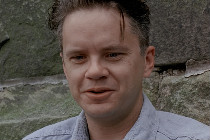
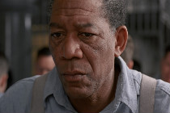
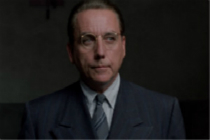
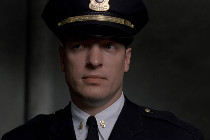
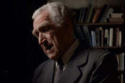
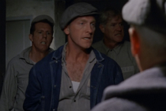

# Characters

| Portraits            | Names         | Introdutions                             |
| -------------------- | ------------- | ---------------------------------------- |
|     | Andy_Dufresne | Andy, the protagonist of the movie, is a short, neat, meticulous man with sandy blond hai. he has small hands and wears gold-rimmed glasses. Most of the other inmates think that Andy is cold and snobbish because he’s always so calm and composed, rarely revealing his inner thoughts or true character. Andy eventually becomes the prison librarian and financial wizard, offering free tax advice to guards and wardens in exchange for protection and favors. He’s one of the few innocent inmates at Shawshank. |
|      | Red           | Red, the best friend of Andy, is a convicted and institutional murderer serving a life sentence. He is a key figure inside prison, a lifeline to the outside world who can smuggle almost anything into the prison—for a price. Once paroled, he struggles with his newfound freedom, but he is dissatisfied with his job. Finally, he goes Zihuatanejo and finds Andy by the seaside. |
|    | Samuel Norton | He is the prison warden of the Shawshank. He is the prison warden of the Shawshank. He is cold-blooded,  merciless and  stony-hearted. He uses Andy’s financial expertise to hide his illegal earnings and therefore refuses to help Andy win a retrial. Norton eventually resigns in disgrace after Andy’s escape. |
|  | Byron Hadley  | He is a prison guard with cruel coldness and a tall man with thinning red hair. Hadley speaks loudly and rudely and uses the threat of violence to control the prisoners. He is pessimistic, cynical, and paranoid. Andy’s offer to help Hadley avoid paying taxes on the money marks the beginning of Andy’s career as the prison’s financial wizard. Hadley eventually has a heart attack and retires. |
|    | Old Brook     | Old brook is a kind and friendly librarian of the Shawshank. He is paroled in 1954 after serving 50 years, but he cannot adjust to the outside world, and he commits suicide by hanging himself. |
|  | The Sisters   | The gang of inmates who prey on weaker prisoners. They maintain their dominance in the hierarchy of prisoners by beating and gang-raping new inmates, including Andy. Andy always fights back even though he usually loses. Andy eventually wins protection from the Sisters after helping the guards and wardens with their finances. |