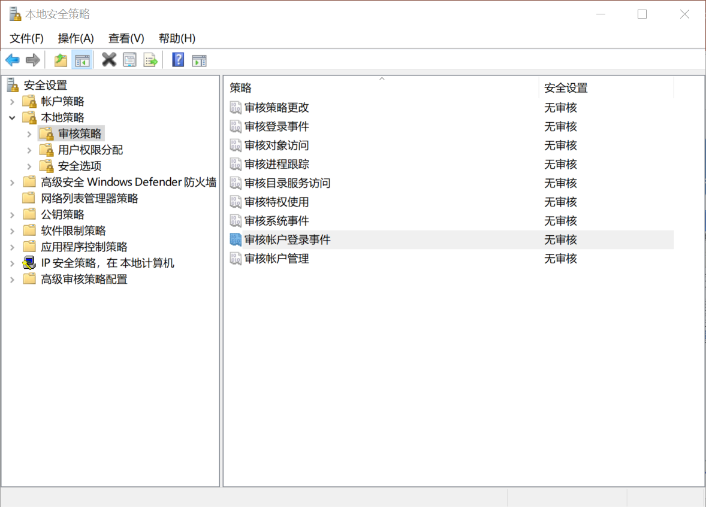
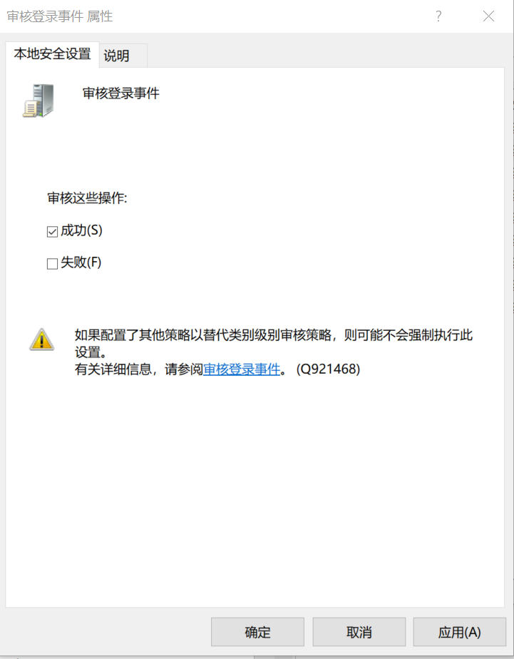
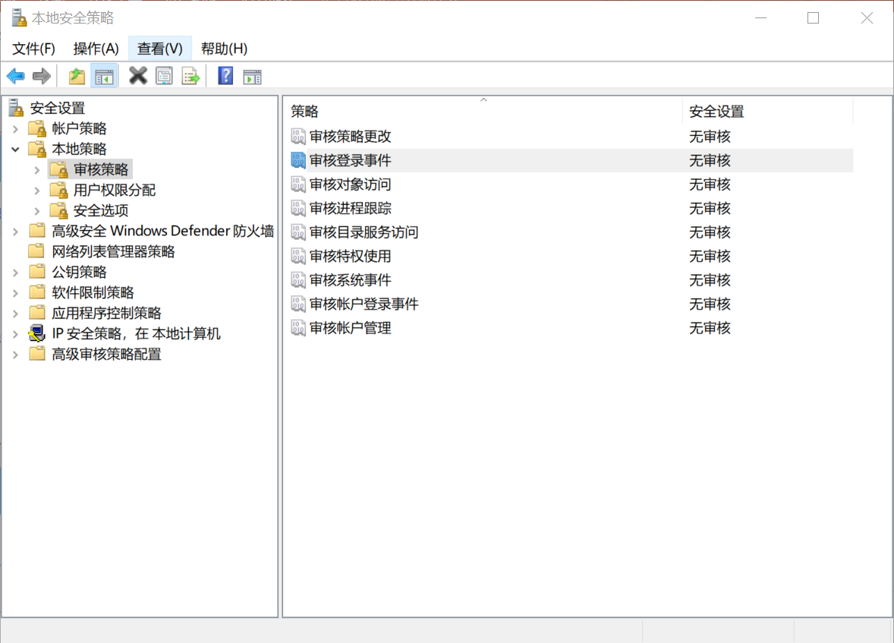
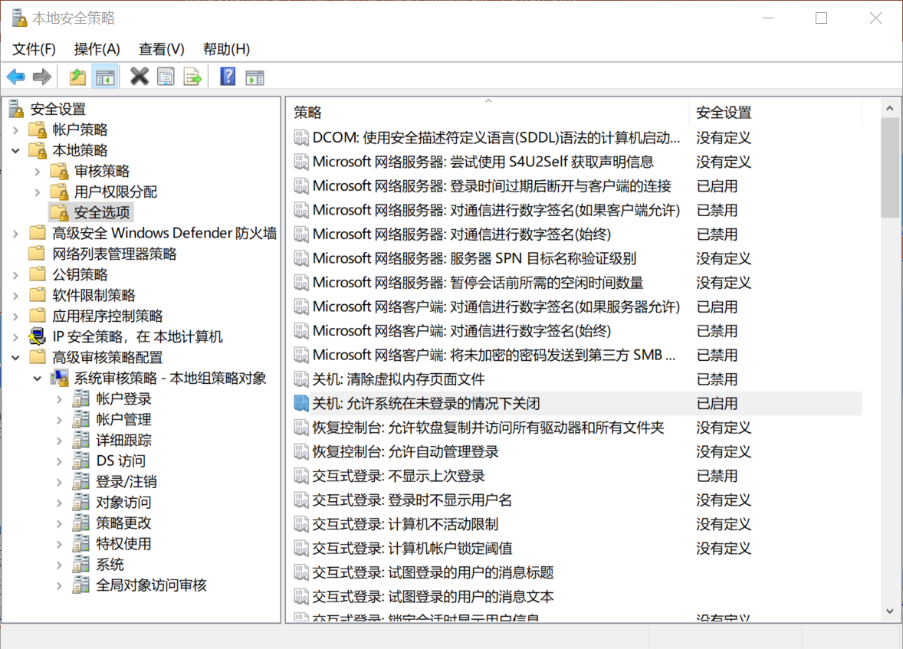
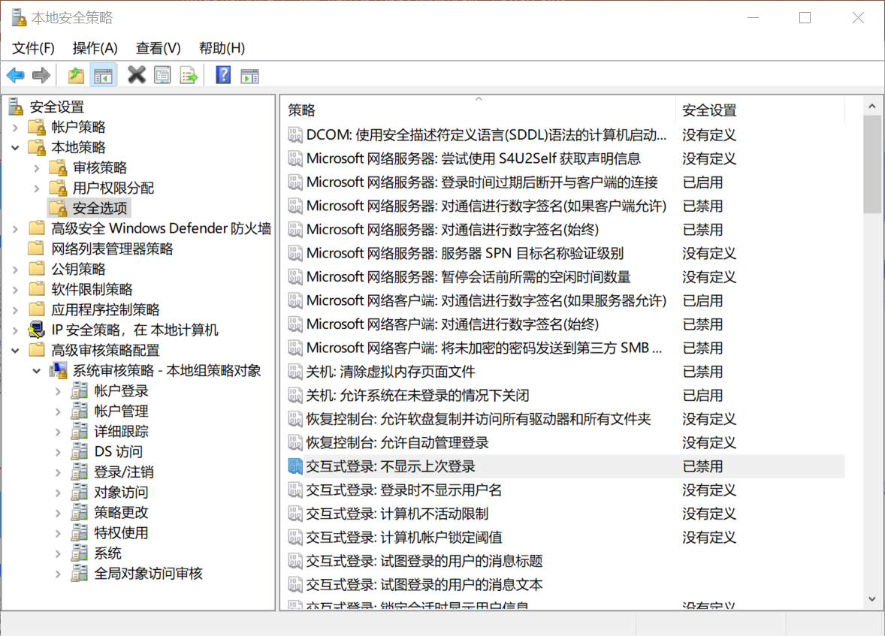
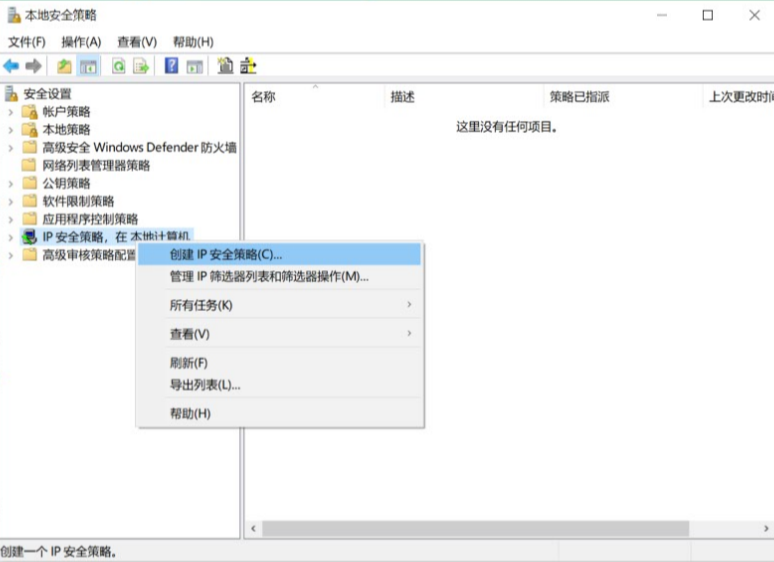
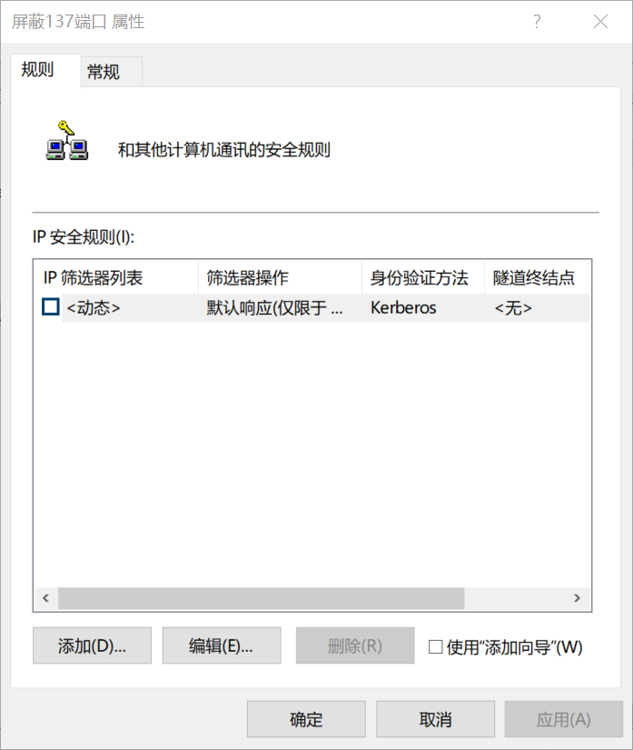
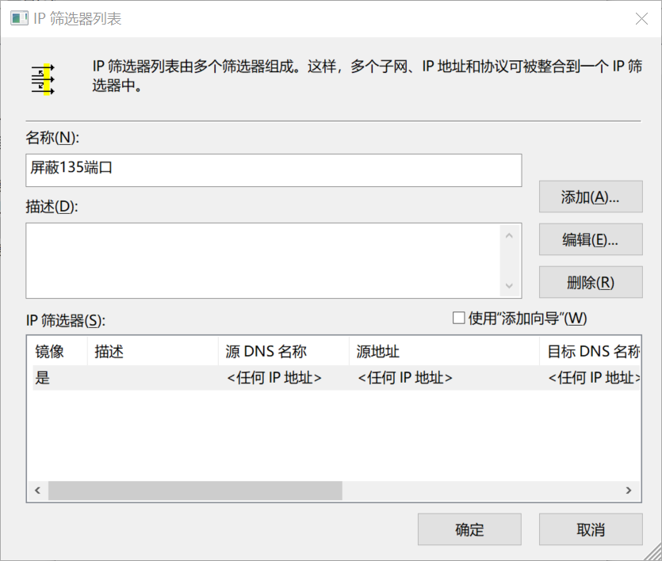
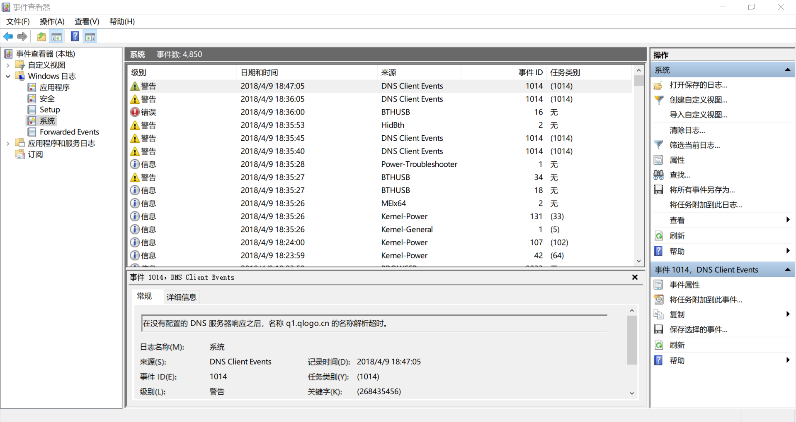
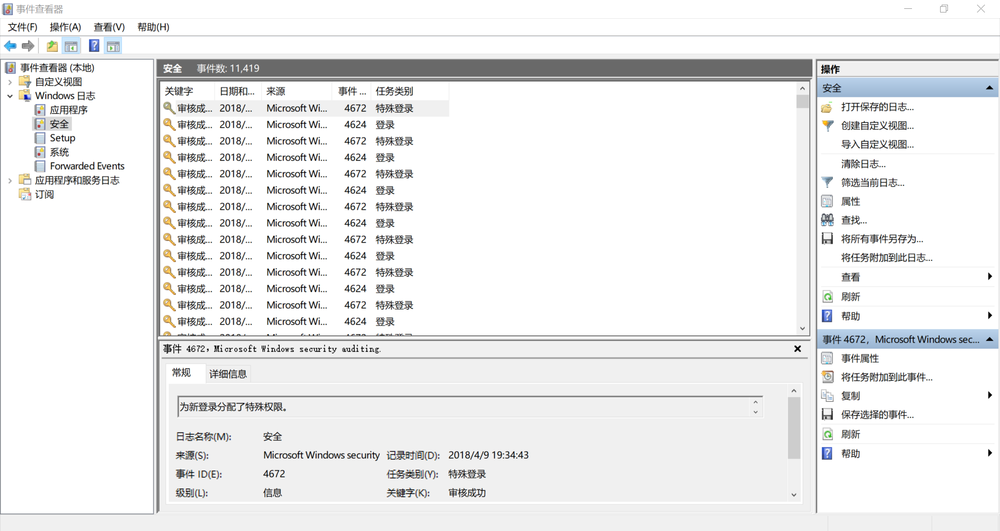

.png)

# 本科实验报告

## 实验名称：windows系统安全与加固技术实验

| 课程名称  | 信息安全与对抗实践基础 |  实验时间   | 2018年4月9日 |
| :---: | :---------: | :-----: | :-------: |
| 任课教师  |             |  实验地点   | 理学楼B座2层机房 |
| 实验教室  |             |         |  √ 原理验证   |
| 学生姓名  |             |  实验类型   |  □ 综合设计   |
| 学号/班级 |             |         |  □ 自主设计   |
|  学院   |             | 组号/同组搭档 |           |
|  专业   |             |   成绩    |           |

.png)

[TOC]

## I. 实验简介

​	使用Windows系统下的安全策略和安全审核，提出典型网络安全的解决方案。

## II. 实验设备与环境

​	在本次实验中，实验设备为我的电脑，Lenovo Yoga 2，系统为Windows 10 专业版；实验网络为理学楼B座2层机房的BIT-Web无线网。

## III. 实验目的

​	为计算机设置完善的安全策略，维护计算机系统的安全。

## IV. 实验基本原理

1. “审核登录事件”设置用于确定是否对用户在记录审核事件的计算机上登录、注销或建立网络连接的每个实例进行审核。帐户登录事件是在帐户所在的位置生成的，而登录事件是在登录尝试发生的位置生成的。
2. “审核帐户登录事件”设置用于确定是否对用户在另一台计算机上登录或注销的每个实例进行审核，该计算机记录了审核事件，并用来验证帐户。如果定义了该策略设置，则可指定是否审核成功、失败或根本不审核此事件类型。
3. “不显示上次登录的用户名”安全设置确定是否在 Windows 登录屏幕中显示最后登录到计算机的用户的名称。如果启用该策略，则不会在“登录到 Windows”对话框中显示最后成功登录的用户的名称。如果禁用该策略，则会显示最后登录的用户的名称。目的保护个人隐私，不显示上次登录的用户名，维护用户权益。
4. IP安全策略是一个设置通讯分析的策略，它将通讯内容与设定好的规则进行比较以判断通讯是否与预期相吻合，然后决定是允许还是拒绝通讯的传输，它弥补了传统TCP/IP设计上的"随意信任"重大安全漏洞，可以实现更仔细更精确的TCP/IP安全。

## V. 实验方法概述

1. 【开始】-【控制面板】-【管理工具】-【本地安全策略】-【本地策略】-【策略审核】-【审核登录事件】-【审核登录事件】，选项上单击右键，选择【属性】

2. 审核过程跟踪：【运行】-【打开】窗口输入“secpol.msc”，出现审核登录事件窗口。

3. 禁止在登录前关机：【开始】-【运行】-输入“secpol.msc”-打开-【本地安全设置】

4. 不显示上次登录的用户名：【本地安全设置】-【安全设置】-【本地策略】-【安全选项】

5. 创建一个IP安全策略：单击【开始】菜单，然后选择【设置】-【控制面板】，在弹出的【控制面板】中，双击【管理工具】图标，进入到【管理工具】中，再次双击其中的【本地安全策略】图标并进入到"本地安全策略"对话框中。

6. 用鼠标右击“IP安全策略”，选择“创建IP安全策略”命令，在弹出的“IP安全策略向导”对话框中，单击“下一步”按钮，输入IP安全策略的名称，如“屏蔽135端口”，再次单击“下一步”按钮，保持默认参数设置不变，直至完成位置，这样就创建出来了一个“屏蔽135端口”的安全策略。

7. 设置IP筛选器：鼠标右击"IP安全策略"-"管理IP筛选器和筛选器操作"-"添加"按钮-在弹出的"IP筛选器列表"中输入名称"屏蔽135端口"-"添加"按钮-"下一步"按钮-在目标地址中选择"我的IP地址"-"下一步"按钮-在协议中选择"TCP"(一般选择此项，根据具体的端口设定，如关闭ICMP协议时，这里选择ICMP)-在设置IP协议端口中选择从任意端口到此端口（在此端口中输入135），即可完成屏蔽135端口的设置。

   •鼠标右击"IP安全策略"-"管理IP筛选器和筛选器操作"-"添加"按钮-在弹出的"IP筛选器列表"中输入名称"屏蔽135端口"-"添加"按钮-"下一步"按钮-在目标地址中选择"我的IP地址"-"下一步"按钮-在协议中选择"TCP"(一般选择此项，根据具体的端口设定，如关闭ICMP协议时，这里选择ICMP)-在设置IP协议端口中选择从任意端口到此端口（在此端口中输入135），即可完成屏蔽135端口的设置。

## VI. 实验主体 —— 流程与记录

 -  设置审核登录事件、审核过程跟踪、审核账户登录事件。

    

    

    

 -  通过计算机管理，设置禁止在登录前关机、不显示上次登录的用户名的功能。

    

    

 -  掌握创建一个IP安全策略，设置IP筛选器、筛选器和指派，要求对tcp的137、138端口屏蔽。

    

    

    

    

 -  设置系统日志、安全日志的功能，通过查看这些信息、警告或错误，我们分析实验室主机的状态。

    

    

## VII. 思考

### 审核登录事件、审核过程跟踪、审核账户登录事件用途？

- “审核登录事件”设置用于确定是否对用户在记录审核事件的计算机上登录、注销或建立网络连接的每个实例进行审核。如果正在域控制器上记录成功的帐户登录审核事件，工作站登录尝试将不生成登录审核。只有域控制器自身的交互式登录和网络登录尝试才生成登录事件。总而言之，帐户登录事件是在帐户所在的位置生成的，而登录事件是在登录尝试发生的位置生成的。

  成功审核会在登录尝试成功时生成一个审核项。该审核项的信息对于记帐以及事件发生后的辩论十分有用，可用来确定哪个人成功登录到哪台计算机。失败审核会在登录尝试失败时生成一个审核项，该审核项对于入侵检测十分有用，但此设置可能会导致进入 DoS 状态，因为攻击者可以生成数百万次登录失败，并将安全事件日志填满。

- “审核过程跟踪”设置用于确定是否审核事件的详细跟踪信息，如程序激活、进程退出、句柄复制和间接对象访问等。成功审核会在成功跟踪过程时生成一个审核项。失败审核会在跟踪过程失败时生成一个审核项。

  启用“审核过程跟踪”将生成大量事件，因此通常都将其设置为“无审核”。但是，在事件响应期间，即过程详细日志开始记录和这些过程被启动的时间，这些设置会发挥很大的作用。

- “审核账户登录事件”确定是否审核用户登录或注销另一台计算机(用于验证账户)的每个实例。在域控制器上对域用户账户进行身份验证时会生成账户登录事件。该事件记录在域控制器的安全日志中。在本地计算机上对本地用户进行身份验证时会生成登录事件。该事件记录在本地安全日志中。不生成账户注销事件。

  此安全设置确定是否审核用户登录或注销另一台计算机(用于验证账户)的每个实例。在域控制器上对域用户账户进行身份验证时会生成账户登录事件。该事件记录在域控制器的安全日志中。在本地计算机上对本地用户进行身份验证时会生成登录事件。该事件记录在本地安全日志中。不生成账户注销事件。

  如果在域控制器上为账户登录事件启用成功审核，则为该域服务器验证的每位用户记录审核项，即使该用户事实上已登录到加入该域的工作站上。