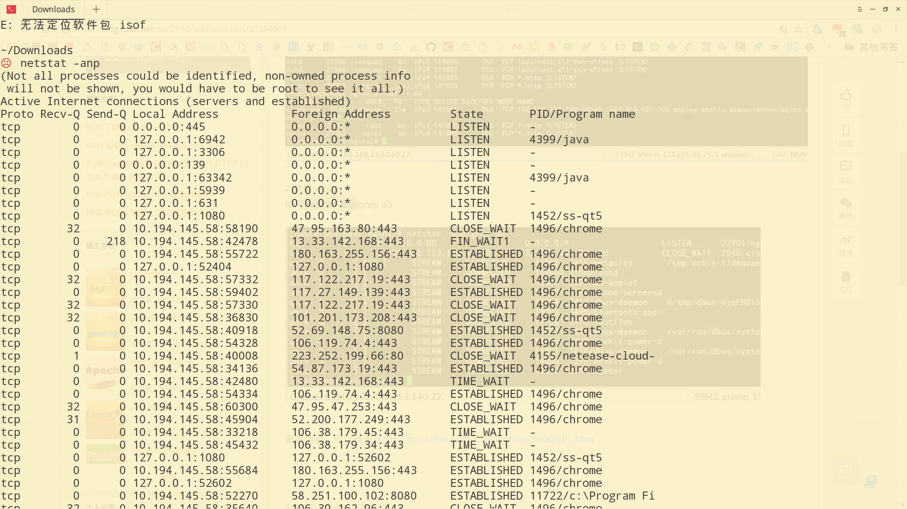
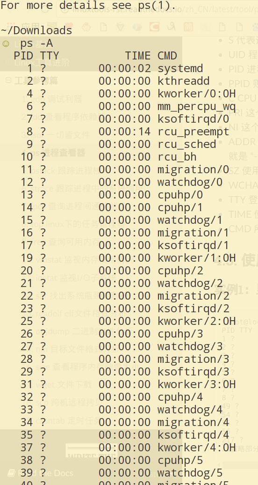
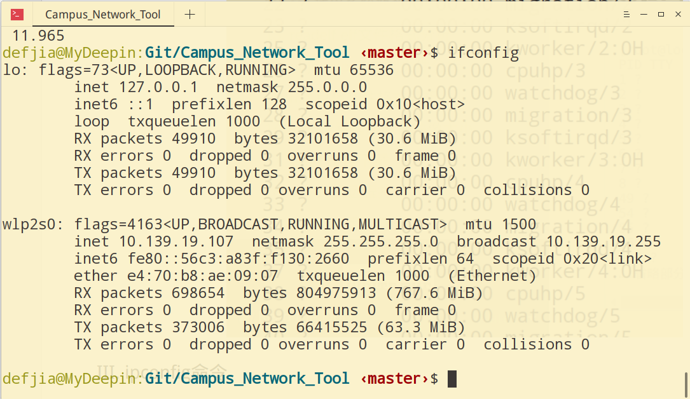
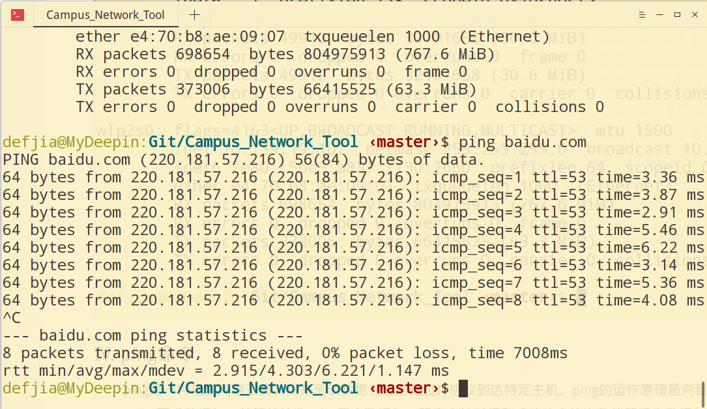
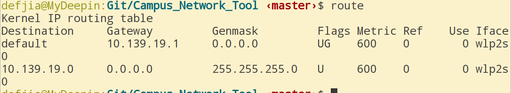
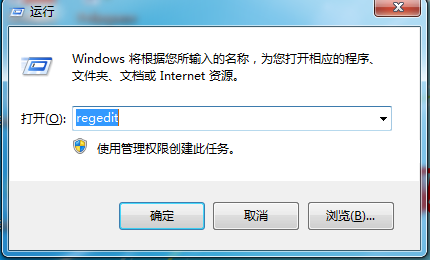
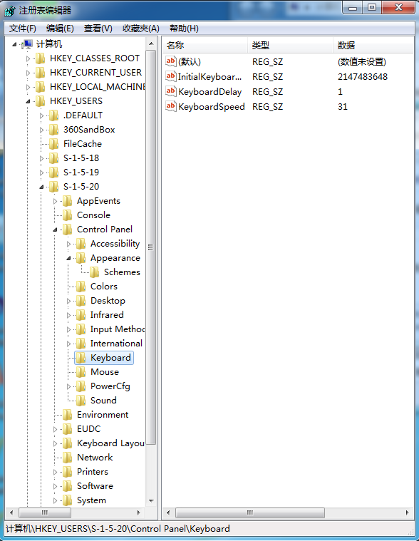

.png)

# 本科实验报告

$\ \ \ \ \ \ \ \ $

#### 实验名称：操作系统注册表和常用网络命令实验

| 课程名称  | 信息安全与对抗实践基础 |  实验时间   | 2018年4月23日 |
| :---: | :---------: | :-----: | :--------: |
| 任课教师  |             |  实验地点   | 理学楼B座2层机房  |
| 实验教室  |             |         |   √ 原理验证   |
| 学生姓名  |             |  实验类型   |   □ 综合设计   |
| 学号/班级 |             |         |   □ 自主设计   |
|  学院   |             | 组号/同组搭档 |            |
|  专业   |             |   成绩    |            |

.png)

$\ \ \ $

## 实验目的	

- 使用Windows系统下的网络命令，具体要求：Ipconfig命令、 Ping命令、 Tracert命令、Netstat命令、Route命令、 NBTSTAT命令。
- 检查计算机端口状态，分析端口对主机的作用。

## 实验基础知识

- 在网络技术中，端口(Port)大致有两种意思：一是物理意义上的端口，比如，ADSL Modem、集线器、交换机、路由器用于连接其他网络设备的接口，如RJ-45端口、SC端口等等；二是逻辑意义上的端口，一般是指TCP/IP协议中的端口，端口号的范围从0到65535，比如用于浏览网页服务的80端口，用于FTP服务的21端口等等。
- 在网络技术中，一般是指TCP/IP协议中的端口，端口号的范围从0到65535，比如用于浏览网页服务的80端口，用于FTP服务的21端口等等。我们这里将要介绍的就是逻辑意义上的端口。
- 计算机“端口”是英文port的义译，可以认为是计算机与外界通讯交流的出口。其中硬件领域的端口又称接口，如：USB端口、串行端口等。软件领域的端口一般指网络中面向连接服务和无连接服务的通信协议端口，是一种抽象的软件结构，包括一些数据结构和I/O（基本输入输出）缓冲区。
- 面向连接服务TCP协议和无连接服务UDP协议使用16bits端口号来表示和区别网络中的不同应用程序，网络层协议IP使用特定的协议号（TCP 6，UDP 17）来表示和区别传输层协议。
- 任何TCP/IP实现所提供的服务都是1-1023之间的端口号，这些端口号由IANA分配管理。其中，低于255的端口号保留用于公共应用；255到1023的端口号分配给各个公司，用于特殊应用；对于高于1023的端口号，称为临时端口号，IANA未做规定。
  - 常用的保留TCP端口号有：HTTP 80，FTP 20/21，Telnet 23，SMTP 25，DNS 53等。
  - 常用的保留UDP端口号有：DNS 53，BootP 67（server）/ 68（client），TFTP 69，SNMP 161等。

## 实验方法及实践

1. 远程端口扫描
   - netstat \[-a] \[-e] \[-n] \[-s] \[-p protocol] \[-r] \[interval] 
     - -a : 显示所有连接和侦听端口。服务器连接通常不显示。 
     - -e : 显示以太网统计。该参数可以与 -s 选项结合使用。 
     - -n : 以数字格式显示地址和端口号（而不是尝试查找名称）。
     - -s : 显示每个协议的统计。默认情况下，显示 TCP、UDP、ICMP 和 IP 的统计。
     - -p : 可以用来指定默认的子集。 
     - -p : protocol 显示由 protocol 指定的协议的连接；protocol 可以是 tcp 或 udp。如果与 -s 选项一同使用显示每个协议的统计，protocol 可以是 tcp、udp、icmp 或 ip。 
     - -r : 显示路由表的内容。 
     - interval : 重新显示所选的统计，在每次显示之间暂停 interval 秒。按 CTRL+B 停止重新显示统计。如果省略该参数，netstat 将打印一次当前的配置信息。
2. 查看本地网络配置命令
3. 本地进程——端口察看：Fport / Vision、AntiyPorts、APorts
   - Fport是FoundStone出品的一个用来列出系统中所有打开的TCP/IP和UDP端口，以及它们对应应用程序的完整路径、PID标识、进程名称等信息的软件。
   - 可以使用fport这个程序来显示本机开放端口与进程的对应关系。 
4. 本地进程察看：Pslist、Listdlls

## 实验结果及数据分析

#### 实验环境

- 本实验主要运行环境为Deepin 15.5(基于Debian的Linux系统)。

#### I. 端口扫描

#### II. 本地进程查看

$\ \ \ \ \ \ \ \ $在此实验中，我通过Linux系统下的ps命令代替了Windows软件，可以得到相同的效果。

#### III. ipconfig命令

​	在Linux系统下，ifconfig命令与ipconfig等效。	

#### IV. ping命令

$\ \ \ \ \ \ \ \ $ping是一种电脑网络工具，用来测试数据包能否通过IP协议到达特定主机。ping的运作原理是向目标主机传出一个ICMPecho要求数据包，并等待接收echo回应数据包。程序会按时间和成功响应的次数估算丢失数据包率和数据包往返时间。

#### V. Route命令

$\ \ \ \ \ \ \ \ $在数据包没有有效传递的情况下，可以利用route命令查看路由表；如果traceroute命令揭示出一条异常或低效的传输路径，则可以用route命令来确认为何选择该路径，而且可以配置一个更有效的路由。

#### VI. 注册表实践

1. 在windows系统下的运行中输入regedit，进入注册表。

   

2. 注册表界面如图。注册表是windows操作系统中的一个核心数据库，其中存放着各种参数，直接控制着windows的启动、硬件驱动程序的装载以及一些windows应用程序的运行，从而在整个系统中起着核心作用。这些作用包括了软、硬件的相关配置和状态信息，比如注册表中保存有应用程序和资源管理器外壳的初始条件、首选项和卸载数据等，联网计算机的整个系统的设置和各种许可，文件扩展名与应用程序的关联，硬件部件的描述、状态和属性，性能记录和其他底层的系统状态信息，以及其他数据等。

   

   ​

## 总结

$\ \ \ \ \ \ \ \ $通过这一次实验，我对操作系统中的注册表有了简单的认识，也学到了很多网络命令知识，在日常生活或学习科研中都有广泛的应用。比如检查网络状态，配置网卡，卸载“流氓软件”等，同时，在Linux的使用过程中，这些命令更是如鱼得水，可以让我们更加熟悉操作机器的网络状态。
