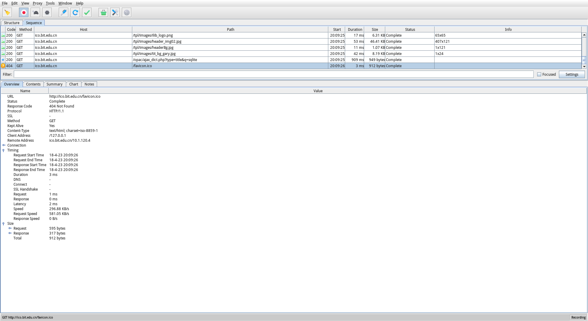

.png)

# 本科实验报告

## 实验名称：网络安全软件工具分析与应用

| 课程名称  | 信息安全与对抗实践基础 |  实验时间   | 2018年4月16日 |
| :---: | :---------: | :-----: | :--------: |
| 任课教师  |             |  实验地点   | 理学楼B座2层机房  |
| 实验教室  |             |         |   √ 原理验证   |
| 学生姓名  |             |  实验类型   |   □ 综合设计   |
| 学号/班级 |             |         |   □ 自主设计   |
|  学院   |             | 组号/同组搭档 |            |
|  专业   |             |   成绩    |            |

.png)

[TOC]

## I. 实验目的

​	学习使用扫描器和嗅探器，了解它们的不同分类，并通过实验学习相关网络知识，了解TCP/IP等协议，抓取TCP包，UDP包，对HTTP协议进行分析，提高网络安全意识。

## II. 实验基础知识

#### 1. 扫描器

​	扫描器是进行信息收集的必要工具，它可以完成大量的重复性工作，为使用者收集与系统相关的必要信息。通过使用扫描器，可以发现远程服务的各种TCP端口的分配及提供的服务和它们的软件版本，这就能让黑客或管理员间接或直观地了解远程主机所存在的安全问题。

- 按使用对象不同分类为本地扫描器和远程扫描器，对于黑客来说，使用更多的是远程扫描器，因为远程扫描器也可以用来扫描本地主机。
- 按扫描的目的来分类，可分为端口扫描器和漏洞扫描器。

#### 2. 嗅探器

​	嗅探器（sniffer）是一种用来收集有用数据的软件。用它可以监视网络的状态、数据流动情况以及网络上传输的信息。嗅探器就像一把双刃剑，如果到了黑客手中，自然成了探测的工具，但如果在系统管理员手中，则能帮助用户监控异常的网络流量，从而更好地管理好网络。

## III. 实验方法及实践

#### 1. 扫描器

###### (1) 扫描软件

- SuperScan
  - 通过Ping来检验IP是不是在线
  - IP和域名相互转换
  - 检验目标计算机提供的服务类型
  - 检验一定范围内目标计算机的在线和端口情况
- X-Scan
- 流光
- SSS

###### (2) 扫描方法 

- 锁定主机：打开软件，输入域名，单击“锁定”按钮，得到域名对应的IP地址。
- 端口扫描：选择扫描类型，单击“开始”按钮，对端口进行扫描。
- 端口设置：该软件可以对选定的端口进行扫描，单击“端口设置”按钮，这时会出现“编辑端口列表”对话框。通过双击列表中的项目来选定要扫描的端口。
- 木马检测
  - 单击“端口设置”按钮，出现“编辑端口列表”对话框。
  - 单击“载入”按钮。
  - 在弹出的选择文件对话框中选中trojans.lst文件，单击“打开”按钮。
  - 回到“编辑端口列表”对话框，单击“确定”按钮完成端口设置。
  - 回到主界面，单击“开始”按钮进行扫描

#### 2. 嗅探器

###### (1) 主要软件

- Iris

  ​	Iris嗅探器是一款非常优秀的网络通信分析工具，它不但可以抓包、对所捕获的数据进行解码，还可以对数据进行编辑后重新发送，帮助系统管理员轻易地捕获和查看用户的使用情况，同时还能够检测到进入和发出的信息流，自动进行存储和统计、进行查看和管理。

- SnifferPRO

- Wireshark

  ​	 wireshark是网络包分析工具。主要作用是尝试捕获网络包， 并尝试显示包的尽可能详细的情况。网络管理员使用Wireshark来检测网络问题，网络安全工程师使用wireshark来检查资讯安全相关问题，开发者使用Wireshark来为新的通讯协定除错。

- Charles

###### (2)扫描方法 

- 启动软件：打开Wireshark，让它开始监听网络数据包，当我们点击登录按钮并登录成功后再停止监听。
- 设置显示过滤参数：为了减小范围，可以在filter中输入ip.src== 10.168.35.167   && http，它表示IP来源是本机IP，使用的协议是http，下面是找到的结果。
- 登录网页
- 查看结果：找到嗅探到的登录信息，双击就会出现该条信息的详细信息，可看到嗅探到的用户名和密码。

## IV. 实验结果及数据分析

#### 1. 扫描

​	在Linux系统下，使用扫描器Zenmap。

- 输入要扫描的IP地址，*为通配符。

  

- ​

  

- 扫描出有端口暴露的主机的ip地址。

  

- ​

  

- 对于暴露22端口的主机，扫描可以得出其public key与SSH版本，以及系统内核版本。

  

#### 2. 嗅探

- 首先，拿Chrome浏览器的内置抓包工具定向捕捉Http包。

  

- 得到返回信息

  

- 通过http代理的方式，将流量通过软件Charles。

  

- 向图书馆数据库提交请求，可以看到，本机向图书馆数据库服务器发送了一个Http的Get请求，请求参数中包含我提交的文本内容。

  

## V. 总结

​	数据在网络上是以很小的称为帧(Frame)的单位传输的帧由好几部分组成，不同的部分执行不同的功能。（例如，以太网的前12个字节存放的是源和目的的地址，这些会告诉网络：数据的来源和去处。以太网帧的其他部分存放实际的用户数据、TCP/IP的报文头或IPX报文头等）。

​	帧通过特定的网络驱动程序进行成型，然后通过网卡发送到网线上。通过网线到达它们的目的机器，在目的机器的一端执行相反的过程。接收端机器的以太网卡捕获到这些帧，并告诉操作系统帧的到达，然后对其进行存储。就是在这个传输和接收的过程中，嗅探器会造成安全方面的问题。

​	黑客软件层出不穷，只会使用某些工具是不行的，这样永远是被别人牵着鼻子走。要知其然，还要知其所以然，这就要求我们多思考，多实践，能够做到举一反三。
