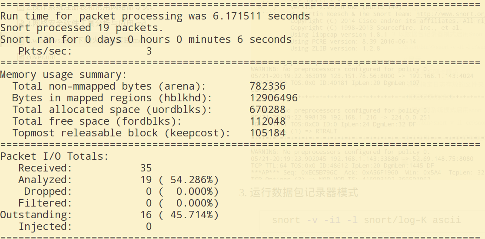
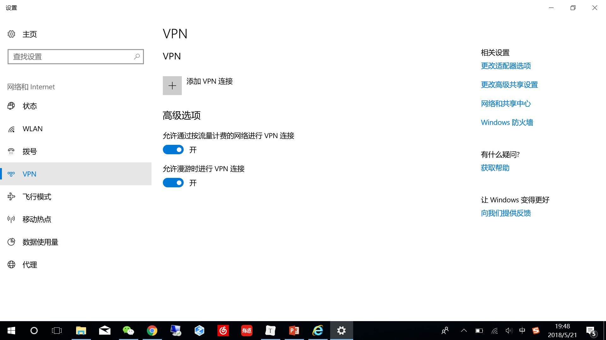

.png)

# 本科实验报告

## 实验名称：windows系统下防火墙的实践

| 课程名称  | 信息安全与对抗实践基础 |  实验时间   | 2018年4月9日 |
| :---: | :---------: | :-----: | :-------: |
| 任课教师  |             |  实验地点   | 理学楼B座2层机房 |
| 实验教室  |             |         |  √ 原理验证   |
| 学生姓名  |             |  实验类型   |  □ 综合设计   |
| 学号/班级 |             |         |  □ 自主设计   |
|  学院   |             | 组号/同组搭档 |           |
|  专业   |             |   成绩    |           |


.png)

[TOC]

## 实验目的

1. 配置Windows自带防火墙或瑞星防火墙设置

2. 配置代理服务器

3. 嗅探模式使用Snort

4. 数据包记录器模式使用Snort

5. 建立VPN客户端的配置

## 实验基础知识

#### 防火墙

​	在计算机科学领域中，防火墙（英语：Firewall）是一个架设在互联网与企业内网之间的信息安全系统，根据企业预定的策略来监控往来的传输。防火墙可能是一台专属的网络设备或是运行于主机上来检查各个网络接口上的网络传输。它是目前最重要的一种网络防护设备，从专业角度来说，防火墙是位于两个(或多个)网络间，实行网络间访问或控制的一组组件集合之硬件或软件。

#### 代理服务器

​	代理（英语：Proxy）也称网络代理，是一种特殊的网络服务，允许一个网络终端（一般为客户端）通过这个服务与另一个网络终端（一般为服务器）进行非直接的连接。一些网关、路由器等网络设备具备网络代理功能。一般认为代理服务有利于保障网络终端的隐私或安全，防止攻击。提供代理服务的电脑系统或其它类型的网络终端称为代理服务器（英文：Proxy Server）。

​	一个完整的代理请求过程为：客户端首先与代理服务器创建连接，接着根据代理服务器所使用的代理协议，请求对目标服务器创建连接、或者获得目标服务器的指定资源（如：文件）。在后一种情况中，代理服务器可能对目标服务器的资源下载至本地缓存，如果客户端所要获取的资源在代理服务器的缓存之中，则代理服务器并不会向目标服务器发送请求，而是直接返回缓存了的资源。一些代理协议允许代理服务器改变客户端的原始请求、目标服务器的原始响应，以满足代理协议的需要。代理服务器的选项和设置在计算机程序中，通常包括一个“防火墙”，允许用户输入代理地址，它会遮盖他们的网络活动，可以允许绕过互联网过滤实现网络访问。

#### Snort

​	Snort是一套开放源代码的网络入侵预防软件与网络入侵检测软件。Snort使用了以侦测签名（signature-based）与通信协议的侦测方法。截至目前为止，Snort的被下载次数已达到数百万次。 Snort被认为是全世界最广泛使用的入侵预防与侦测软件。

#### VPN（虚拟私人网络）

​	虚拟私人网络（英语：Virtual Private Network，缩写为VPN）是一种常用于连接中、大型企业或团体与团体间的私人网络的通讯方法。虚拟私人网络的讯息透过公用的网络架构（例如：互联网）来传送内部网的网络讯息。它利用已加密的通道协议（Tunneling Protocol）来达到保密、发送端认证、消息准确性等私人消息安全效果。这种技术可以用不安全的网络（例如：互联网）来发送可靠、安全的消息。需要注意的是，加密消息与否是可以控制的。没有加密的虚拟专用网消息依然有被窃取的危险。

## 实验方法

#### 防火墙配置

1. 在“控制面板”窗口中双击“Windows防火墙”图标，即可启动Windows防火墙主程序。
2. 在“Windows防火墙”对话框中，选择“常规”选项卡，勾选“不允许例外”复选框，Windows系统防火墙将阻止所有连接到本地计算机的请求，甚至包括请求来自“例外”选项卡上列出的程序或服务。
3. 在“Windows防火墙”对话框中切换到“例外”选项卡，在这可以添加程序和端口例外，以允许特定的传入通信，并可以为每个例外设置范围。如果开放某个端口，则对这个端口的访问将被允许。端口或服务可以在“例外”选项中设置或通过指定指定应用程序的方法设置，如果开放端口的服务不是一个应用，则可以设置开放的协议和端口号。
4. 在“Windows防火墙”对话框中，选择“高级”选项卡，在“安全日志记录选项组”中单击设置按钮，即打开“日志设置”对话框，在其中可以创建用于观察计算机成功的数据连接和丢弃的数据包，从而分析计算机安全状况，还可以单击“另存为”按钮，浏览选择日志文件保存的路径。
5. 在ICMP选项组中单击“设置”按钮，在打开的“ICMP设置”对话框中选择是否勾选各个选项，可以保证计算机的一些信息不会对外泄露，若取消勾选“允许传入回显请求”复选框
   ，则需要先在“描述”选项组中可以看到这个选项的介绍，此时把445端口关掉之后，即可取消勾选此复选框。

#### 代理服务器配置

1. 在IE浏览器中选择“工具”→“Internet选项”命令，打开“Internet选项”对话框。
2. 在“连接”选项卡中，单击“局域网设置”按钮，打开“局域网设置”对话框。
3. 勾选“为LAN使用代理服务器”复选框，并填入代理服务器的地址和端口。

#### Snort实践

1. 运行Snort，查看参数，在命令行模式下进入“C:\Snort\bin”子文件夹，输入snort –w命令，将会列出Snort命令的参数及用法。

2. 以嗅探模式启用Snort

   c:\Snort\bin>snort–v 

   -v表示使用Verbose模式，将信息显示在屏幕上

3. 以数据包记录器模式启用Snort

   c:\Snort\bin>>snort -v -i1 -l c:\snort\log–K ascii

     -v 显示

     -i 表示监听网卡顺序

     -l 选项指定日志存放的文件夹

     -K指定记录的格式

4. 以入侵检测系统模式启用snort

    C:\Snort\bin>snort -v -i1 -cc:\snort\etc\snort.conf -l c:\snort\log -K ascii

   -c :表示使用snort.conf中规则集文件，规则集文件位于C:\Snort\rules文件夹中

#### 配置VPN

1. 右键单击“网上邻居”，选择“属性”，出现的属性界面中单击“创建一个新连接”。单击“下一步”。
2. 选择网络连接类型：连接到我的工作场所的网络。
3. 创建网络连接：选择“虚拟专用网络连接”。
4. 输入连接名
5. 选择“不拨初始连接”选项，再单击“下一步”
6. 输入VPN服务器的IP地址，再单击“下一步”
7. 选择“不使用我的智能卡”，再单击“下一步”
8. 单击“完成”按钮，则VPN客户端配置完成
9. 打开刚建立的连接，输入服务器的用户名和密码，再单击“连接”按钮。
10. 出现身份验证界面，连接成功。

## 实验数据及结果

#### 防火墙配置

1. 在控制面板中打开防火墙。

   

2. 配置细节。

   

#### 代理服务器配置

1. 在IE浏览器中打开Interner选项。

   

2. 在选项中设置细节。

   

#### Snort实践

1. 安装snort

   

2. 运行snort -v操作

   

3. 运行数据包记录器模式

   ```bash
   snort -v -i1 -l snort/log–K ascii
   ```

   

4. 运行入侵检测系统模式

   ```bash
   snort -v -i1 -cc /etc/snort.conf -l snort/log -K ascii
   ```

   

#### 配置VPN

1. 打开windows10中的VPN设置界面。

   

2. 配置VPN，填入代理服务器信息。

   

3. 配置成功，并尝试连接。

   

## 实验总结

​	通过这一课程的实验，我学到了很多新知识，新技术，比如Snort和代理服务器配置；也了解了很多以前曾经使用过的功能的原理和知识，比如VPN和防火墙。通过一次又一次的动手实践，我对这些操作熟悉了不少，也对操作系统和网络的了解更多了几分。
